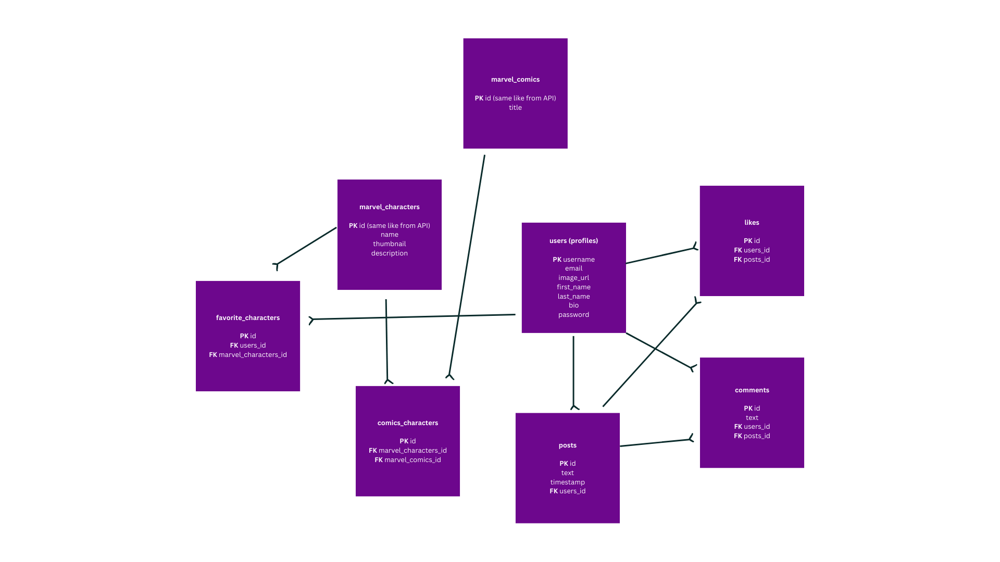

# Marvel App

I have broken down the Marvel App Project into easy-to-follow steps. Here’s a quick overview of what I did for each step of your capstone project.

1. Step One: Initial Project Ideas: I’ll pick up to 3 project ideas to propose to my mentor and the Springboard community. I’ll also explore some potential APIs.
2. Step Two: Project Proposal: For this step, I’ll write a proposal for the site I want to build. This will help my mentor better understand my chosen capstone project idea.
3. Step Three: Schema Design and API Selection: After my mentor approves of my capstone project proposal, I’ll figure out the database design of my application and which API I’ll be using.
4. Step Four: Coding User Flows: Once I’ve figured out what I’m building, I’ll write the code to implement it. It’s important to think about what I want a user’s experience to be like as they navigate my site.
5. Step Five: Polishing My Application: Once I have the core functionality implemented, I’ll focus on additional UI enhancements and styling for my application.
6. Step Six: Documenting and Submission: I’ve done a lot of work so now it’s time to show my mentor my progress! Create a README in markdown, make sure my GitHub is organized, and submit my finalized project.

## Database Design:

## Overview

This application harnesses the power of the Marvel API to retrieve information about Marvel characters and the comics they appear in. It offers a platform where users can create personal accounts to access various features.

### Features

- Account Creation: Users can sign up to create their own accounts, enabling a personalized experience.
- Login/Logout Functionality: Secure login/logout mechanisms ensure that user sessions are individually managed and protected.
- Search Functionality: With an integrated search bar, users can easily find any Marvel character they are interested in.
- Social Interaction: The app allows users to express their thoughts and engage with the community through posting. Posts can be liked and commented on by others, fostering a vibrant and interactive environment.

This project aims to provide Marvel enthusiasts with a comprehensive tool to explore their favorite characters and comics, while also offering a platform for community interaction and sharing.

### User Flow

- Users can log in or sign up (if they haven't) for the app.
- On the homepage, users can see brief information about different characters.
- To view details of a character, users can click on individual Marvel characters.
- Users can add Marvel characters to their favorite list.
- Users can update their bio information on their personal page.
- Users can post and share their opinions.
- In the News page, users can view others' posts, like them, and leave comments.

## Tech Stack

**Back-end**

- Python, Flask
- PostgreSQL, SQLAlchemy
- Render
- Jinja
- RESTful APIs
- WTForms

**Front-end**

- HTML,CSS
- Javascript, Jquery
- AJAX (axios)

## Marvel's API link

[Here is the link to my API.](https://developer.marvel.com/docs)

To utilize the Marvel API for fetching data, you need to follow a few essential steps to gain access:

- Login Requirement: Initially, you must log in to obtain a public key and a private key, which are crucial for making requests to the Marvel API.

- Hash Generation: To ensure secure API calls, Marvel requires a hashed value in each request. To generate this hash:

  - Visit MD5 Hash Generator.
  - Create an MD5 hash using a combination of secret_text, private_key, and public_key.
  - The secret_text is created by you, as the API user. It can be any arbitrary value.

- This hash, along with your public and private keys, will be used in all API requests to authenticate and pull data securely from Marvel's servers.
